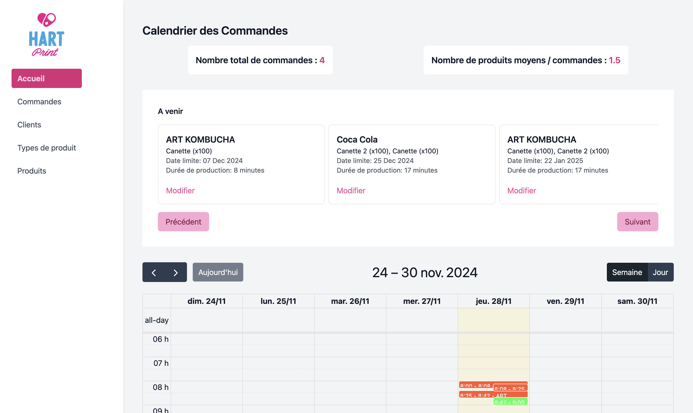

# Production Schedule Optimization

This project is a production scheduling application designed to optimize the workflow of managing production orders.

**The link to the application (deployed on Heroku)**: [https://production-schedule-e59b861a1850.herokuapp.com](https://production-schedule-e59b861a1850.herokuapp.com)



## Installation

Follow the steps below to set up the project locally or deploy it to a platform like Heroku.

### Prerequisites

-   **Node.js** (v16.x recommended)
-   **npm** (Node Package Manager)
-   **PHP** (For Laravel)
-   **Composer** (For PHP dependencies)

### Steps to run locally

1. **Clone the repository**:

    ```bash
    git clone https://github.com/your-repo/production-schedule-optimization.git
    cd production-schedule-optimization
    ```
